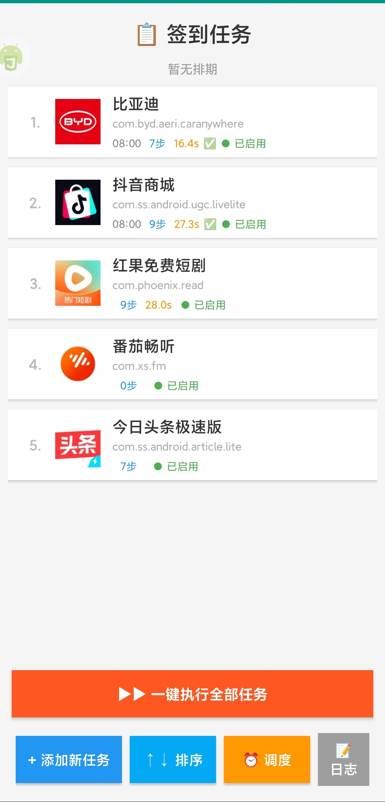
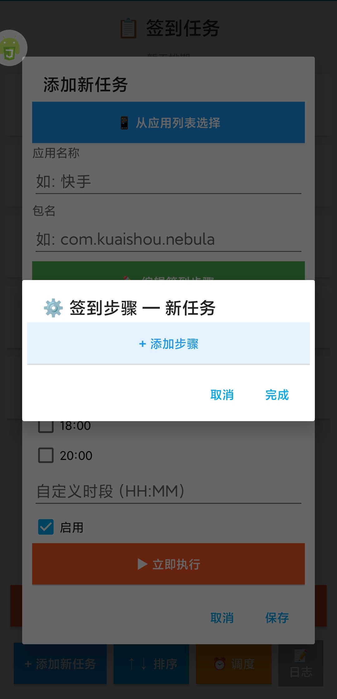
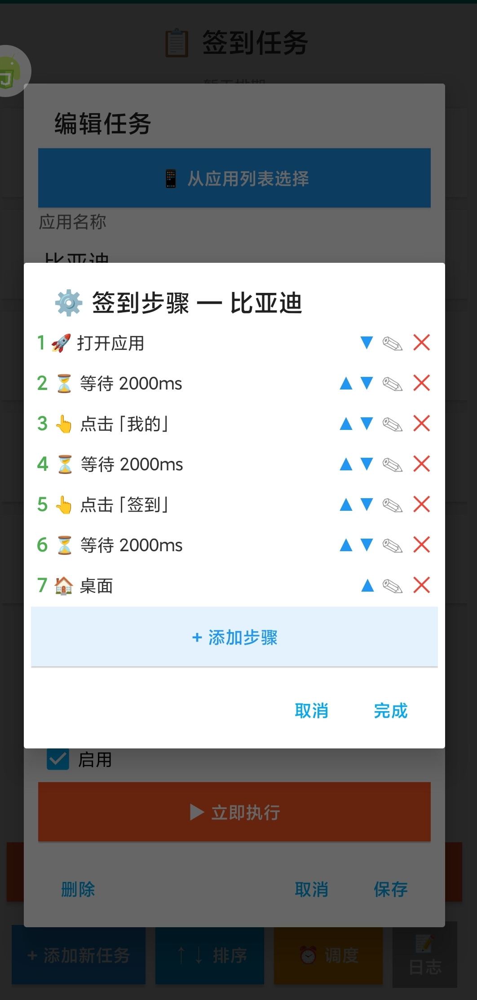
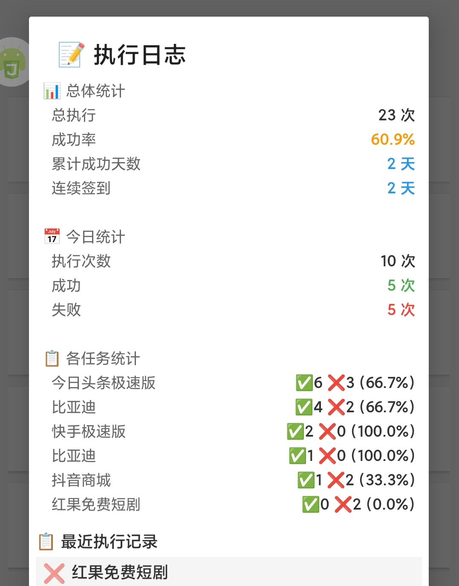

# 📋 签到工具 — AutoJS 自动化签到助手

基于 [AutoJS](https://github.com/hyb1996/Auto.js) 的 Android 自动化签到工具，自动完成各类 App 的每日签到任务，无需手动操作。

## 功能特性

- **可视化任务管理** — 添加、编辑、排序、启用/禁用签到任务，从已安装应用列表快捷选择
- **步骤编排引擎** — 拖拽式步骤编辑器，支持 13 种自动化操作，灵活编排签到流程
- **定时调度执行** — 后台调度器每分钟巡检，到达预设时段自动执行签到（默认 08:00 / 12:00 / 14:00 / 18:00 / 20:00）
- **一键批量执行** — 点击"一键执行全部任务"按序号依次运行所有已启用任务
- **执行日志与统计** — 记录每次执行结果，展示成功率、连续签到天数、各任务统计
- **应用图标展示** — 自动从 iTunes API 获取应用图标并缓存到本地
- **插件扩展** — 支持自定义插件，内置快手、今日头条签到模板

## 运行截图

| 任务列表 | 步骤编辑 |
|:---:|:---:|
|  |  |

| 添加任务 | 执行日志 |
|:---:|:---:|
|  |  |

## 安装使用

### 1. 安装 AutoJS

在 Android 手机上下载安装 [AutoJS](https://github.com/hyb1996/Auto.js)（需开启无障碍服务权限）。

### 2. 导入项目

将本项目所有文件复制到手机存储目录：

```
/sdcard/签到工具/
├── app-main.js      # 主界面
├── step-engine.js   # 步骤执行引擎
├── scheduler.js     # 后台调度器
├── store.js         # 数据存储
├── project.json     # 项目配置
├── plugins/         # 签到插件
│   ├── kuaishou.js  # 快手
│   └── toutiao.js   # 今日头条
├── data/            # 运行时数据（自动创建）
└── res/             # 资源文件
```

### 3. 运行

在 AutoJS 中打开 `app-main.js` 即可启动。

## 操作指南

### 添加签到任务

1. 点击 **"+ 添加新任务"**
2. 点击 **"📱 从应用列表选择"** 快速选取目标 App，或手动输入应用名称和包名
3. 点击 **"✏️ 编辑签到步骤"** 编排自动化流程
4. 勾选需要的执行时段（支持自定义时段，如 `09:30`）
5. 点击保存

### 编排签到步骤

可用的步骤类型：

| 类型 | 说明 |
|------|------|
| 🚀 启动应用 | 打开目标 App |
| ⏳ 等待 | 等待指定毫秒数 |
| ⏳ 等待文字 | 等待指定文字出现在屏幕上 |
| 👆 点击文字 | 查找并点击匹配文字的按钮（支持精确/包含/描述多级匹配） |
| 👆 点击 ID | 通过控件 ID 点击 |
| 👆 点击描述 | 通过 content-desc 点击 |
| 👆 点击坐标 | 点击屏幕指定坐标 |
| ↕ 滑动 | 从起点滑动到终点 |
| 🔙 返回 | 执行返回操作 |
| 🏠 桌面 | 回到桌面 |
| ✖ 关闭应用 | 强制关闭目标 App |
| ❓ 条件判断 | 根据文字是否存在执行不同分支 |
| 🔄 循环 | 重复执行子步骤 N 次 |

每个步骤支持 ▲▼ 调整顺序，点击 ✎ 编辑参数，点击 ✕ 删除。

### 调度执行

点击 **"⏰ 调度"** → **"启动调度"**，调度器将每分钟检查一次，到达任务设定的时段时自动执行。任务可设置多个时段（如 08:00、20:00 各执行一次）。

### 查看日志

点击 **"📝 日志"** 查看：
- 总体执行次数、成功率、累计成功天数、连续签到天数
- 今日统计（执行次数 / 成功 / 失败）
- 各任务独立统计
- 最近 20 条执行记录详情

## 添加新 App 插件

在 `plugins/` 目录创建新的 `.js` 文件：

```js
module.exports = {
  name: "App名称",
  packageName: "com.example.app",
  steps: [
    { type: "launch" },
    { type: "wait", value: 5000 },
    { type: "clickText", value: "签到" },
    { type: "wait", value: 2000 },
    { type: "back" }
  ]
};
```

添加任务时选择对应插件即可自动加载步骤。

## 技术架构

```
app-main.js          UI 层：界面渲染、用户交互
    ↓
scheduler.js         调度层：定时巡检、自动触发
    ↓
step-engine.js       执行层：步骤解析、控件查找、容错重试
    ↓
store.js             数据层：任务/日志 JSON 持久化
```

- 任务数据存储在 `/sdcard/签到工具/data/tasks.json`
- 执行日志存储在 `/sdcard/签到工具/data/logs.json`（保留最近 100 条）
- 应用图标缓存在 `/sdcard/签到工具/icons/`

## 注意事项

- 需要授予 AutoJS **无障碍服务**和**悬浮窗**权限
- 签到执行期间请勿手动操作手机，避免干扰自动化流程
- 不同手机/系统版本可能存在控件差异，如签到失败请调整步骤中的匹配文字
- 应用图标通过 iTunes API 获取，部分国内 App 可能无图标

## AI 辅助开发

本项目使用 **Claude Code** + **DeepSeek V4 Pro** 完成文档与工程化工作。

### 开发环境

| 项目 | 说明 |
|------|------|
| 开发工具 | Claude Code (CLI) |
| 底层模型 | DeepSeek V4 Pro（1M 上下文窗口） |
| 运行平台 | Windows 11 Pro |
| 交互方式 | 微信消息驱动的远程开发 |
